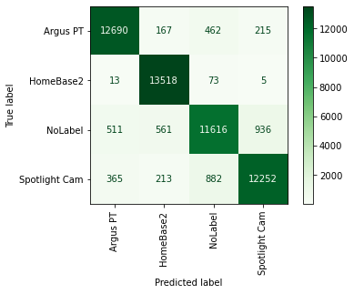

# Identification of Smart Home Devices

<p align="center">
    
<p>

[](https://www.python.org/)


## Abstract

Smart Devices have increasingly found their way into private homes and, while they enable an increase in convenience, they also introduced many security risks.
To mitigate the risks involved, it is important to identify the devices that communicate with external services outside the home and monitor their behavior.
Since identification is the first step in a successful defense against attacks on the smarthome environment, this work builds a base for further research looking to solvesecurity challenges in this domain.
This work compares three different Machine Learning techniques, the Random Forest, the k-nearest-Neighbor and the SupportVector Machine, on their ability to identify Smart Home Devices in a data setof captured network traffic.
It provides a recommendation for the most suitable algorithm, the Random Forest, with a robust feature set as well as a software implementation thereof. The Random Forest trained on a small feature set of onlyfour features (packet length, inter-arrival time, average burst size, average burstlength) performs well with a f1-score of around 92.8 % and shows that the identi-fication of Smart Home Devices can be accomplished with reasonable confidencein a short inference time span of around 119 ms.

## Usage

To start the app call the model class and let it start the Dashboard. Note that the Dashboard is meant to be run in a Jupyter Notebook.

```python
from app.model import Model

model = Model()

model.run_app() # Shows the Dashboard that enables tweaking parameters, running the simulation and plotting the results
```

## Author

**Tobias Becher**

## Acknowledgments

This repository accompanies a thesis paper written at the University of Hagen.

## License

Copyright © 2021 [Tobias Becher](https://github.com/TB-DevAcc). <br/>
This project is [MIT](https://github.com/TB-DevAcc/SHD_Identification/blob/master/LICENSE) licensed.
