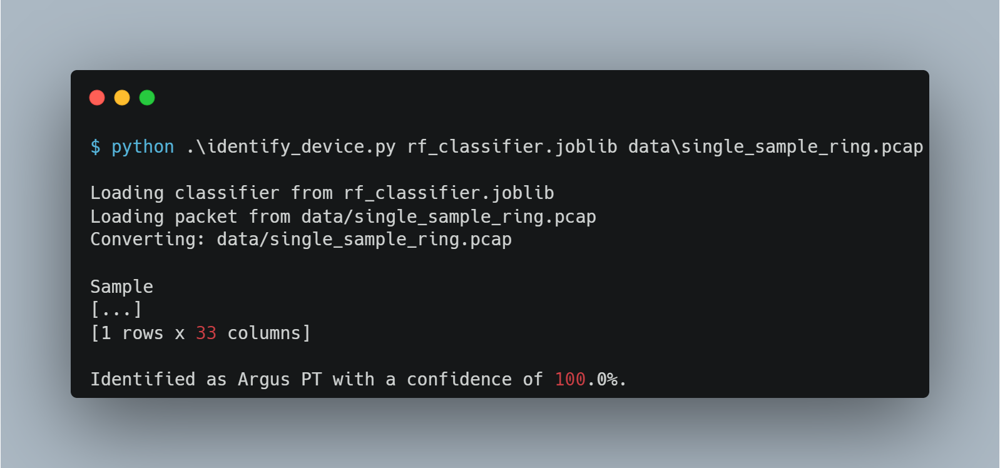

# Identification of Smart Home Devices

    
    
Random Forest Classifier: Classification results for 3 three Smart Home Devices

## Abstract

Smart Devices have increasingly found their way into private homes and, while they enable an increase in convenience, they also introduced many security risks.
To mitigate the risks involved, it is important to identify the devices that communicate with external services outside the home and monitor their behavior.
Since identification is the first step in a successful defense against attacks on the smarthome environment, this work builds a base for further research looking to solvesecurity challenges in this domain.
This work compares three different Machine Learning techniques, the Random Forest, the k-nearest-Neighbor and the SupportVector Machine, on their ability to identify Smart Home Devices in a data setof captured network traffic.
It provides a recommendation for the most suitable algorithm, the Random Forest, with a robust feature set as well as a software implementation thereof. The Random Forest trained on a small feature set of onlyfour features (packet length, inter-arrival time, average burst size, average burstlength) performs well with a f1-score of around 92.8 % and shows that the identi-fication of Smart Home Devices can be accomplished with reasonable confidencein a short inference time span of around 119 ms.

## Usage

The following quick-start example shows the usage of the software.
These prerequisites have to be met:

- a python environment with the packets specified in environment.yml
- a (with `joblib`) serialized ML model (e.g. `rf_classifier.joblib`) that was trained on the feature set containing specified in `training.ipynb`
- a `.pcap` file containing the network packets to classify

    

If the prerequisites are not met or the user wishes to use the identification tool with more fine grained control, they must first provide a suitable dataset. The notebook `training.ipynb` can then be used as a template for preparing the data, training and serializing the classifier. Within the notebook the provided packet capture files can be converted to `pandas.DataFrames` that are necessary to perform model training. Furthermore these DataFrames can be serialized into Python's `.pkl` files. This functionality is provided by `convert_pcap_to_df.py`.
With the data available as serialized data frames, model training can be started by executing the classifier portion of the `training.ipynb` notebook. The resulting RF model is then saved into another serialized python object.

After this, `identify_device.py` can be called to perform the classification and return the identified devices.

## Author

**Tobias Becher**

## Acknowledgments

This repository accompanies a thesis paper written at the University of Hagen.

## License

Copyright © 2021 [Tobias Becher](https://github.com/TB-DevAcc).  
This project is [MIT](https://github.com/TB-DevAcc/SHD_Identification/blob/master/LICENSE) licensed.
